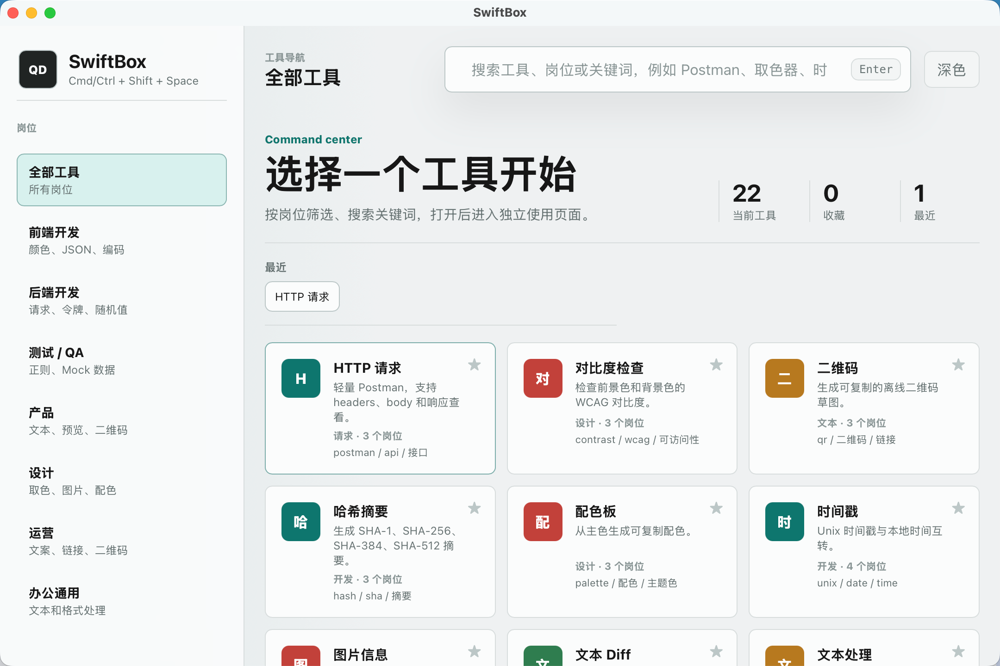

# SwiftBox

SwiftBox 是一个基于 Tauri 2 + React + TypeScript 的桌面快捷工具箱，面向开发、测试、产品、设计、运营和办公场景。

它的目标很简单：把高频小工具放进一个轻量、快速、可离线使用的桌面入口里，让你少切页面、少找工具、少做重复劳动。

- 快捷键一键唤起：`Cmd/Ctrl + Shift + Space`（主窗口）
- 按岗位分类，快速找到对应工具
- 支持命令搜索、收藏、最近使用
- 本地运行，敏感内容不依赖在线服务
- 适合 Mac / Windows / Linux 的日常高频使用

## 为什么值得关注

如果你只是想找一个“工具很多”的应用，市场上已经有很多选择。

SwiftBox 更偏向这几个方向：
- 更快：尽量减少操作步骤和上下文切换
- 更轻：桌面常驻，不把复杂流程塞给用户
- 更贴近工作流：围绕开发、测试、产品、设计、办公这些高频场景组织工具
- 更容易扩展：适合持续加工具、加岗位、加能力

## 预览

> 如果你在 GitHub 上浏览这个仓库，下面这些图会直接显示为预览图。



## 核心功能

### 开发
- 颜色工具
- JSON 工具
- Base64 编解码
- URL 编解码
- 时间戳转换
- UUID / 随机字符串
- JWT 解码
- HTTP 请求工具

### 测试 / QA
- 正则测试
- Mock 数据生成
- 数据格式化与转换

### 产品 / 运营 / 办公
- Markdown 预览
- 文本处理
- 二维码生成
- 常用字符串整理

### 设计
- 图片信息查看
- 配色板工具
- 视觉调试相关小工具

### 通用效率
- 计算器
- 密码生成器
- 房贷计算器（单笔 / 组合 / 提前还款 / 分步计算，可自由增减步骤并自定义缩短年限）
- 剪贴板工具（监听系统剪贴板变化，支持快捷键唤起悬浮窗）
- HTML 实体转换
- XML 格式化
- 大小写 / Slug 转换
- 时区转换

### 高级 API / 安全
- HMAC / Webhook 签名
- AWS SigV4 签名

### 桌面体验
- 关闭窗口后继续后台运行
- 托盘 / 菜单栏右键可退出
- 常用工具可收藏
- 最近使用会自动记录在本地

## 适合谁用

- 经常处理 JSON、URL、Base64、时间戳的开发者
- 需要快速调试接口、构造请求、生成 Mock 数据的后端 / QA 工程师
- 经常做文本处理、Markdown 预览、二维码生成的产品 / 运营 / 办公用户
- 想把常用工具统一收纳在一个桌面应用里的用户

## 在线下载

如果你不想配置开发环境，可以直接下载 GitHub Actions 自动构建的安装包。

1. 打开仓库：[CanxinWu1/SwiftBox](https://github.com/CanxinWu1/SwiftBox)
2. 点击顶部的 **Actions**
3. 在左侧选择 **Build Desktop Apps**
4. 打开最新一次成功的构建记录
5. 滚动到页面底部的 **Artifacts**
6. 按你的系统下载对应安装包

可下载的 Artifacts：

- `swiftbox-macos-apple-silicon`：Apple Silicon Mac（M1 / M2 / M3 / M4）
- `swiftbox-macos-intel`：Intel Mac
- `quickdesk-windows`：Windows 安装包，通常包含 `.msi` 或 `.exe`

下载后解压 Artifact，再运行里面的安装包或 `.dmg` 文件即可。

## macOS 首次打开提示

Actions 构建出来的 macOS 包没有经过 Apple Developer ID 正式公证，首次打开时 macOS 可能提示：

> Apple 无法验证 “SwiftBox” 是否包含可能危害 Mac 安全或泄漏隐私的恶意软件。

如果你确认安装包来自本项目 Actions，可以使用下面任一方式打开。

### 方式一：右键打开

1. 在 Finder 中找到 `SwiftBox.app`
2. 按住 `Control` 并点击应用
3. 选择 **打开**
4. 弹窗中再次点击 **打开**

### 方式二：系统设置放行

1. 打开 **系统设置**
2. 进入 **隐私与安全性**
3. 找到 `SwiftBox` 被阻止的提示
4. 点击 **仍要打开**

### 方式三：命令行解除隔离

```bash
xattr -dr com.apple.quarantine /Applications/SwiftBox.app
```

如果应用还在下载目录，把路径换成实际位置：

```bash
xattr -dr com.apple.quarantine ~/Downloads/SwiftBox.app
```

## 本地运行

适合想二次开发、调试或自己打包的用户。

### 环境要求

- Node.js 22 或更高版本
- pnpm 10 或更高版本
- Rust stable
- Tauri 2 所需系统依赖

macOS 通常需要安装 Xcode Command Line Tools：

```bash
xcode-select --install
```

Windows 需要安装 Rust、Node.js，并准备 Visual Studio C++ 构建工具。Linux 需要额外安装 WebKitGTK 等 Tauri 依赖。

### 克隆项目

```bash
git clone git@github.com:CanxinWu1/SwiftBox.git
cd SwiftBox
```

如果没有配置 SSH，也可以使用 HTTPS：

```bash
git clone https://github.com/CanxinWu1/SwiftBox.git
cd SwiftBox
```

### 安装依赖

```bash
pnpm install
```

### 启动开发版

```bash
pnpm tauri dev
```

默认快捷键：

```text
Cmd/Ctrl + Shift + Space（主窗口）
Cmd/Ctrl + Shift + V（剪贴板历史）
```

点击窗口关闭按钮时，应用会隐藏到后台；再次按快捷键可以唤起。需要完全退出时，在系统托盘或菜单栏图标上右键，选择 **退出**。

### 构建安装包

```bash
pnpm tauri build
```

构建产物通常在：

```text
src-tauri/target/release/bundle/
```

macOS 指定架构构建：

```bash
pnpm tauri build --target aarch64-apple-darwin
pnpm tauri build --target x86_64-apple-darwin
```

Windows 构建建议在 Windows 环境或 GitHub Actions 的 `windows-latest` 上执行：

```bash
pnpm tauri build
```

## 使用说明

1. 打开 SwiftBox 后，可以在顶部搜索框输入工具名、岗位或关键词。
2. 点击左侧岗位分类，可以回到该分类下的工具列表。
3. 点击工具卡片进入具体工具页面。
4. 常用工具可以收藏，最近使用会自动记录在本地。
5. HTTP 请求工具不会保存请求历史、请求正文、Token 或 Cookie 等敏感内容。

## 路线图

SwiftBox 会持续朝着“更像工作台，而不是工具集合”的方向迭代。

- 扩充更多高频岗位工具
- 持续优化搜索和收藏体验
- 让常用任务更少点击、更少输入
- 增加更多本地优先的工具能力
- 优化下载包和分发体验

## 参与贡献

欢迎提 Issue 和 PR。

如果你愿意帮助 SwiftBox 变得更好，可以从这些方向入手：
- 提一个你最常用但这里还没有的工具
- 提一个让操作更快的交互建议
- 提一个你在 Mac / Windows / Linux 上遇到的兼容性问题
- 帮忙优化文案、图标、截图和使用说明

## 许可证

SwiftBox 使用 MIT License，详情见仓库根目录的 [LICENSE](LICENSE) 文件。

## 为什么这个项目适合分享

如果你想把 SwiftBox 介绍给别人，可以直接强调这几点：

- 一个桌面工具箱，覆盖开发、测试、产品、设计和办公
- 不是单一功能工具，而是把高频小工具集中在一个入口里
- 支持本地离线使用，适合日常高频调用
- 有明确的快捷键和桌面常驻体验，上手快

## 开发命令

```bash
pnpm build
pnpm tauri dev
pnpm tauri build
```

## 推荐 IDE

- [VS Code](https://code.visualstudio.com/)
- [Tauri VS Code Extension](https://marketplace.visualstudio.com/items?itemName=tauri-apps.tauri-vscode)
- [rust-analyzer](https://marketplace.visualstudio.com/items?itemName=rust-lang.rust-analyzer)
